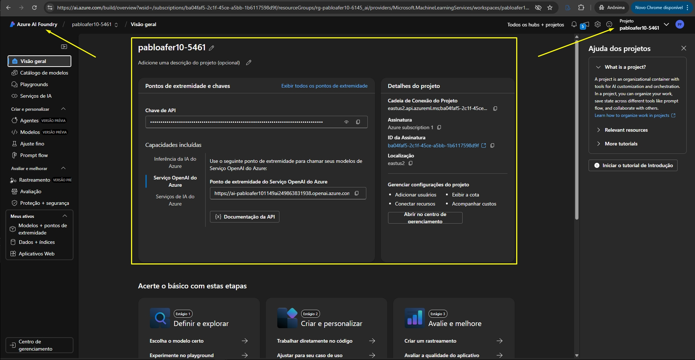
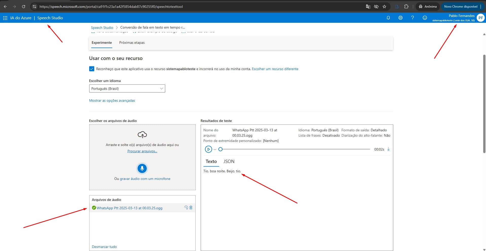
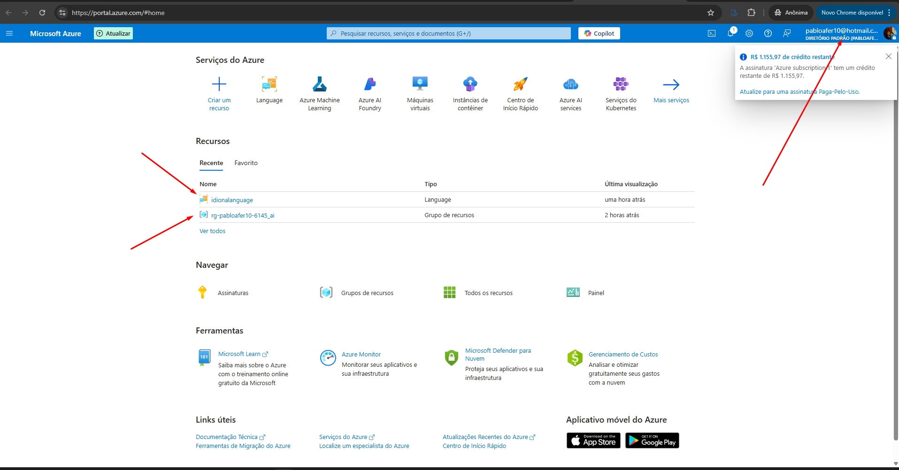
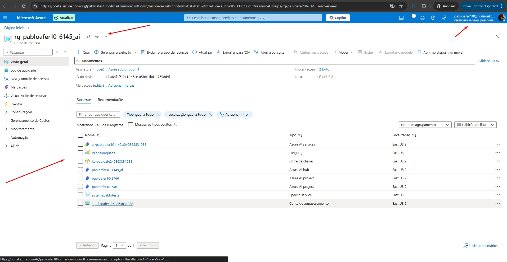
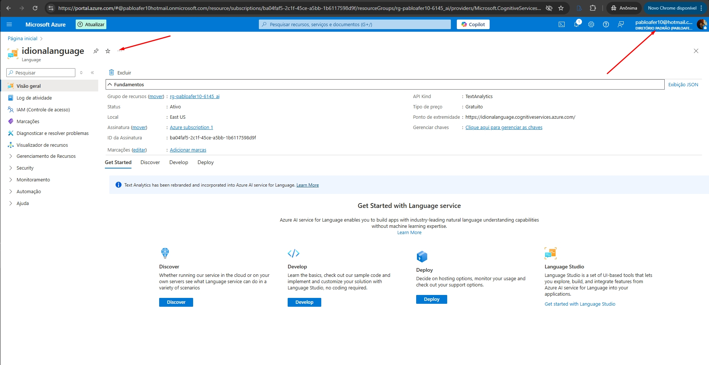

# 🏦 _**Projeto Bootcamp DIO - Análise de Sentimentos com Language Studio no Azure AI**_

## _**Objetivo geral**_
##### **Criar um pasta chamada input e nela criar algumas sentenças. Criar um README.md com prints desse projeto que fizemos**

## _**Desafio**_
##### **Nosso desafio consiste em criar um pasta chamada input e nela criar algumas sentenças e criar um README.md com prints do que conseguimos desenvolver nesse projeto**

## _**O que foi criado**_
**Simulei o que vimos em laboratório, conforme segue nos Screnshot**   
✅ **Criei a pasta de inputs com lista com setenças com conteúdos das aulas teoricas** 
✅ **Criei a pasta de imagens com Screnshot do laboratório**  
✅ **Utilizei a linguagem do curso Python e criei:**   
&nbsp;&nbsp;&nbsp;&nbsp;&nbsp;&nbsp;&nbsp;&nbsp;&nbsp; *** _**Lista com 15 sentenças pertinentes ao contéudo do tópico do curso**_  
&nbsp;&nbsp;&nbsp;&nbsp;&nbsp;&nbsp;&nbsp;&nbsp;&nbsp; *** _**Função que exibe no terminal, aleatóriamente uma sentença da lista**_  

## _**Screnshot**__
-------------------------------------------------------------------------------------------
  
  
   
    
  
 
